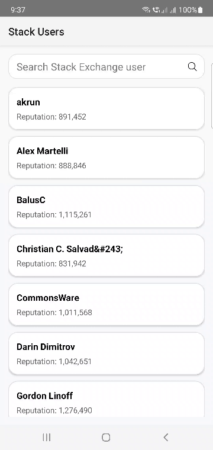

# 📱 Stack Users

Stack Users is a modern Android application that allows users to search and browse StackOverflow users using the StackExchange API. It demonstrates clean architecture, Jetpack components, and best practices in Android development.

---

## ✨ Features

- 🔍 Search users by name
- 📋 Display up to 20 users sorted alphabetically
- 👤 View detailed user profile
- ⚡ Load initial users on app launch (no search required)
- 💾 Local caching using Room

---

## 🎥 Demo



---

## 🛠 Tech Stack

- **Kotlin**
- **MVVM Architecture**
- **Android Jetpack**
  - ViewModel
  - LiveData
  - Navigation Component
  - Room
- **Networking**
  - Retrofit
  - OkHttp
- **Reactive Programming**
  - RxJava2
- **Dependency Injection**
  - Hilt (built on top of Dagger)
- **Image Loading**
  - Glide
- **Testing**
  - JUnit4
  - Mockito

---

## 🧱 Architecture

The project follows **Clean Architecture** with clear separation of concerns:

### 🔹 Presentation Layer
- Fragments
- ViewModels
- UI State (sealed classes)

### 🔹 Domain Layer
- Business models (`User`)
- Repository contract
- Use cases:
  - `SearchUsersUseCase`
  - `GetUserDetailsUseCase`

### 🔹 Data Layer
- Retrofit API (`StackExchangeApi`)
- Room database (UserEntity, DAO)
- Repository implementation
- Mappers (DTO ↔ Domain ↔ Entity)

---

## 🔄 Data Flow

```
UI (Fragment)
   ↓
ViewModel
   ↓
UseCase
   ↓
Repository
   ↓
Remote (API) + Local (Room)
```

---

## 🧪 Testing

Unit tests were implemented using **TDD principles** for:

- SearchUsersUseCase
- GetUserDetailsUseCase
- SearchViewModel
- DetailsViewModel

---

## 🚀 Getting Started

1. Clone the repository
2. Open in Android Studio
3. Sync Gradle
4. Run the app

---

## 📡 API

This app uses the StackExchange API:

- GET /users?inname={query}&site=stackoverflow
- GET /users/{id}?site=stackoverflow

---

## 💡 Design Decisions

- MVVM + Clean Architecture for scalability
- RxJava2 to align with job requirements
- Hilt for simplified dependency injection
- Room for caching and offline support
- Sealed UI states for predictable UI

---

## 📄 License

For demonstration and evaluation purposes.
